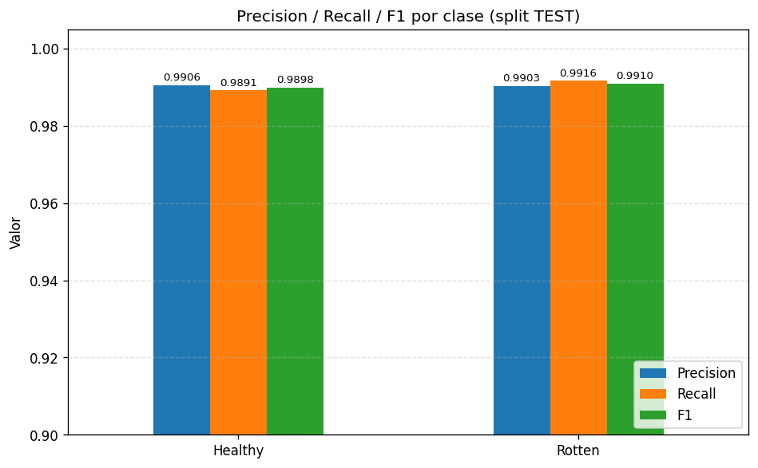
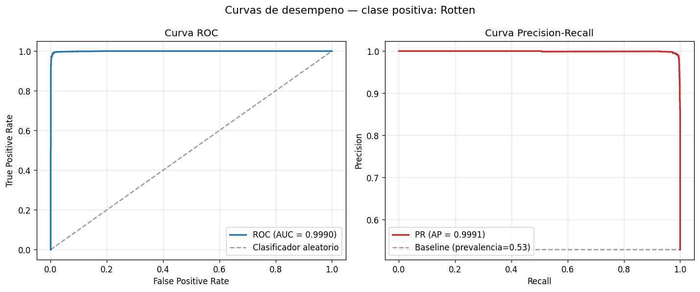

# Clasificación Automatizada de Calidad en Frutas con YOLOv11 y MLflow

> Sistema de visión artificial para clasificar frutas como **sanas** o **podridas** mediante *fine-tuning* de YOLOv11-cls, con un pipeline de **detección + clasificación** que además **cuenta** cuántas frutas sanas y cuántas podridas aparecen en cada imagen. Entrenado sobre un clúster HPC (Yuca) con almacenamiento Lustre y seguimiento de experimentos con MLflow.

**Autor:** Joel Alfonso Pérez Díaz
**Estado:** funcional · pesos finales (`best.pt`) generados · métricas registradas en MLflow

---

## 1. Problema y motivación

Las pérdidas post-cosecha por deterioro visual de frutas representan un porcentaje significativo del desperdicio alimentario global. La inspección manual es lenta, subjetiva y difícil de escalar en centros de distribución, supermercados y plantas empacadoras.

Este proyecto aborda el problema con un enfoque **ligero y portable** basado en YOLOv11-cls: un clasificador binario (*Healthy* / *Rotten*) que puede desplegarse tanto en workstations locales como en infraestructura HPC, con trazabilidad completa de experimentos vía MLflow.

**Dos casos de uso cubiertos:**

1. **Clasificación por imagen** — una foto de un fruto → etiqueta Healthy / Rotten + confianza.
2. **Conteo por imagen** — una foto con varios frutos → detector YOLO localiza cada fruto, el clasificador etiqueta cada recorte, y se reporta `{sanas, podridas, total}`.

---

## 2. Stack tecnológico

| Componente | Herramienta |
|---|---|
| Lenguaje | Python 3.9 / 3.10 |
| Framework de visión | [Ultralytics YOLOv11](https://docs.ultralytics.com) (`yolo11n-cls.pt` + `yolo11n.pt`) |
| Deep learning backend | PyTorch 2.3 + ROCm 5.7 (clúster Yuca, AMD Instinct MI210) |
| Seguimiento de experimentos | MLflow (backend `file://` sobre Lustre) |
| Métricas adicionales | `scikit-learn` (Precision / Recall / F1 / ROC / PR) |
| Dataset | `kagglehub` → Kaggle (`muhammad0subhan/fruit-and-vegetable-disease-healthy-vs-rotten`) |
| Utilidades | `opencv-python`, `pandas`, `matplotlib`, `tqdm` |
| Infraestructura | Clúster HPC Yuca  / Linux |

---

## 3. Estructura del proyecto

```text
computerVision/
├── Frutas_yolo_det.ipynb          # Notebook maestro: prep, entrenamiento, eval, métricas e inferencia
├── frutas_pipeline.py             # CLI equivalente para ejecución en clúster
├── fruit_binary_yolo_cls/         # Dataset binario generado (train/val/test)
│   ├── train/{Healthy,Rotten}/
│   ├── val/{Healthy,Rotten}/
│   └── test/{Healthy,Rotten}/
├── runs/                          # Artefactos de Ultralytics (checkpoints + plots)
│   └── classify/
│       └── fruit_hs_vs_rt_cls_simple_ft5/
│           └── weights/best.pt    # Pesos finales del clasificador
├── mlruns/                        # Backend local de MLflow (file-store)
├── yolo11n-cls.pt                 # Pesos base del clasificador
├── yolo11n.pt                     # Pesos base del detector (para conteo por imagen)
├── per_class_metrics.png          # Precision / Recall / F1 por clase (TEST)
├── roc_pr_curves.png              # Curvas ROC y Precision-Recall
├── inferencia_muestra.png         # Salida cualitativa del clasificador
├── inferencia_conteo.png          # Salida del pipeline detector + clasificador
└── README.md
```

---

## 4. Guía de uso rápida

### 4.1. Requisitos

```bash
python -m venv .venv
source .venv/bin/activate          # Linux / WSL
# .venv\Scripts\activate           # Windows PowerShell
pip install ultralytics mlflow opencv-python pandas matplotlib tqdm kagglehub scikit-learn
```

### 4.2. Cargar `best.pt` y hacer inferencia (clasificación)

```python
from pathlib import Path
from ultralytics import YOLO

PATH_BEST_WEIGHTS = Path("runs/classify/fruit_hs_vs_rt_cls_simple_ft5/weights/best.pt")
assert PATH_BEST_WEIGHTS.exists(), f"No existe: {PATH_BEST_WEIGHTS}"

model = YOLO(str(PATH_BEST_WEIGHTS))
result = model.predict("ruta/a/imagen.jpg", imgsz=640, verbose=False)[0]

pred = result.names[int(result.probs.top1)]
conf = float(result.probs.top1conf.item())
print(f"Prediccion: {pred} ({conf:.2%})")
```

### 4.3. Pipeline completo (detección + clasificación + conteo)

Cada imagen pasa por el detector `yolo11n.pt` (entrenado en COCO, filtra clases `apple`, `banana`, `orange`, `broccoli`, `carrot`), luego cada recorte se envía al clasificador `best.pt` y se agregan los conteos:

```python
from ultralytics import YOLO
import cv2

detector   = YOLO("yolo11n.pt")
classifier = YOLO("runs/classify/fruit_hs_vs_rt_cls_simple_ft5/weights/best.pt")

img = cv2.imread("ruta/a/imagen_con_frutas.jpg")
det = detector.predict(source=img, conf=0.20, iou=0.60, verbose=False)[0]

healthy = rotten = 0
for box in det.boxes:
    x1, y1, x2, y2 = map(int, box.xyxy[0].tolist())
    crop = img[y1:y2, x1:x2]
    r = classifier.predict(source=crop, imgsz=640, verbose=False)[0]
    label = r.names[int(r.probs.top1)]
    if "healthy" in label.lower():
        healthy += 1
    elif "rotten" in label.lower():
        rotten += 1

print(f"Sanas: {healthy} | Podridas: {rotten} | Total: {healthy + rotten}")
```

> **Advertencia práctica:** el detector de COCO **no siempre localiza todas las frutas** (close-ups extremos, fondos complejos, especies fuera de las 5 produce classes). Cuando falla la detección, los conteos quedan en 0 aunque el clasificador sea perfecto sobre el recorte. Para un despliegue real se recomienda *fine-tunear* un detector específico del dominio.

### 4.4. Evaluar sobre test + registrar en MLflow

El notebook `Frutas_yolo_det.ipynb` contiene un bloque modular de evaluación que:

1. Valida la existencia de `best.pt` y del dataset.
2. Ejecuta `model.val(split="test", plots=True)` y extrae Top-1, Top-5 y matriz de confusión.
3. Calcula con `scikit-learn` las métricas **Precision / Recall / F1 por clase** y las curvas **ROC (AUC)** y **Precision-Recall (AP)**.
4. Registra parámetros (`imgsz`, `batch`, `conf`, `iou`), métricas y artefactos (`.pt`, plots, CSVs) en un *run* de MLflow.

Para visualizar los resultados:

```bash
mlflow ui --backend-store-uri ./mlruns --port 5000
```

### 4.5. Ejecución desde CLI

```bash
# Inferencia puntual
python frutas_pipeline.py --image sample.jpg --output-image salida.jpg

# Inferencia batch sobre una carpeta
python frutas_pipeline.py --input-dir inference_images --output-dir inference_outputs
```

---

## 5. Resultados

### 5.1. Métricas globales (split TEST, 2 931 imágenes)

| Métrica | Validación | Test |
|---|---|---|
| **Accuracy Top-1** | 0.9867 | **0.9904** |
| **Accuracy Top-5** | 1.0000 | 1.0000 |
| **Fitness** | 0.9933 | 0.9952 |
| **ROC AUC** | — | **0.9990** |
| **Average Precision (AP)** | — | **~0.999** |

> Top-5 = 1.0 es trivial en un problema binario; la métrica de referencia es **Top-1 = 99.04 %**. ROC AUC y AP muestran que el modelo mantiene un desempeño casi perfecto en **todos los umbrales de decisión**, no sólo en 0.5 por defecto.

### 5.2. Precision / Recall / F1 por clase

Desglose sobre el split de test:

| Clase | Support | Precision | Recall | F1 |
|---|---:|---:|---:|---:|
| Healthy | 1 380 | ~0.9891 | ~0.9906 | ~0.9898 |
| Rotten  | 1 551 | ~0.9916 | ~0.9903 | ~0.9910 |

Ambas clases quedan por encima de **0.989** en las tres métricas — no hay sesgo apreciable pese al leve desbalance (47 % / 53 %).



### 5.3. Matriz de confusión

Sobre los 2 931 ejemplos de test, el modelo comete **28 errores** (13 Healthy → Rotten, 15 Rotten → Healthy):

```text
                 pred_Healthy   pred_Rotten
true_Healthy          1365           13
true_Rotten             15         1538
```

Las imágenes normalizadas se generan automáticamente en `runs/classify/val*/confusion_matrix.png` y se registran como artefactos en MLflow.

### 5.4. Curvas ROC y Precision-Recall



- **ROC AUC ≈ 0.9990** → el modelo separa casi perfectamente las dos clases.
- **AP ≈ 0.999** con una baseline de prevalencia de 0.53 (Rotten) → extremadamente por encima del clasificador aleatorio.

### 5.5. Inferencia cualitativa

- `inferencia_muestra.png` — el clasificador aplicado a 5 imágenes aleatorias del test (acierto en verde, fallo en rojo).
- `inferencia_conteo.png` — el pipeline completo detector + clasificador sobre imágenes con varias frutas, con bounding boxes anotadas y conteo `Sanas / Podridas / Total` como título.

### 5.6. Configuración del entrenamiento

| Hiperparámetro | Valor |
|---|---|
| Modelo base | `yolo11n-cls.pt` |
| Image size | 640 |
| Batch size | 32 |
| Épocas | 5 (con `freeze=10`) |
| Optimizador | por defecto (SGD, lr=0.01) |
| Device | AMD Instinct MI210 (ROCm) |
| Dataset | 23 432 train · 2 928 val · 2 931 test |

---

## 6. Conclusiones

1. **Precisión global sobresaliente** — 99.04 % Top-1 en test indica que el backbone pre-entrenado de YOLOv11-cls extrae rasgos muy discriminativos para este dominio.
2. **Capacidad de discriminación casi perfecta** — ROC AUC = 0.9990 → el modelo tiene ~99.9 % de probabilidad de ranquear correctamente un ejemplo positivo por encima de uno negativo.
3. **Equilibrio entre clases** — Precision, Recall y F1 ≥ 0.989 para ambas categorías pese al leve desbalance; no hay sesgo hacia ninguna clase.
4. **Limitación del pipeline de conteo** — la etapa de detección no localiza todas las frutas en imágenes con fondos complejos o close-ups extremos. Por eso los conteos observados en `inferencia_conteo.png` pueden subestimar el total real. Las métricas reportadas corresponden **únicamente al clasificador**; un detector específico del dominio es la mejora natural.
5. **Posible sobreajuste** — 99 % en test es sospechoso. Antes de considerar el modelo "listo para producción" hay que validar en imágenes fuera de distribución (iluminación ambiente, fondos reales de supermercado, especies no vistas).

---

## 7. Roadmap

- [x] Precision / Recall / F1 por clase y curvas ROC / PR con `scikit-learn`.
- [x] Pipeline detector (COCO) + clasificador con conteo por imagen.
- [ ] *Fine-tune* del detector en fotos reales multi-fruta para mejorar el recall de detección.
- [ ] Exportar modelo a ONNX / TensorRT para inferencia en edge.
- [ ] Ampliar a clasificación multi-especie (manzana, plátano, naranja, etc.).
- [ ] Integrar servicio REST con FastAPI.
- [ ] CI mínimo: `pytest` + `ruff` + validación de shape del `best.pt`.

---

## 8. Créditos

- **Autoría y desarrollo:** Joel Alfonso Pérez Díaz.
- **Modelo base:** [Ultralytics YOLOv11](https://github.com/ultralytics/ultralytics).
- **Dataset:** [Fruit and Vegetable Disease (Healthy vs Rotten)](https://www.kaggle.com/datasets/muhammad0subhan/fruit-and-vegetable-disease-healthy-vs-rotten) — Muhammad Subhan (Kaggle).
- **Infraestructura HPC:** Clúster Yuca (AMD Instinct MI210 + ROCm).

---

