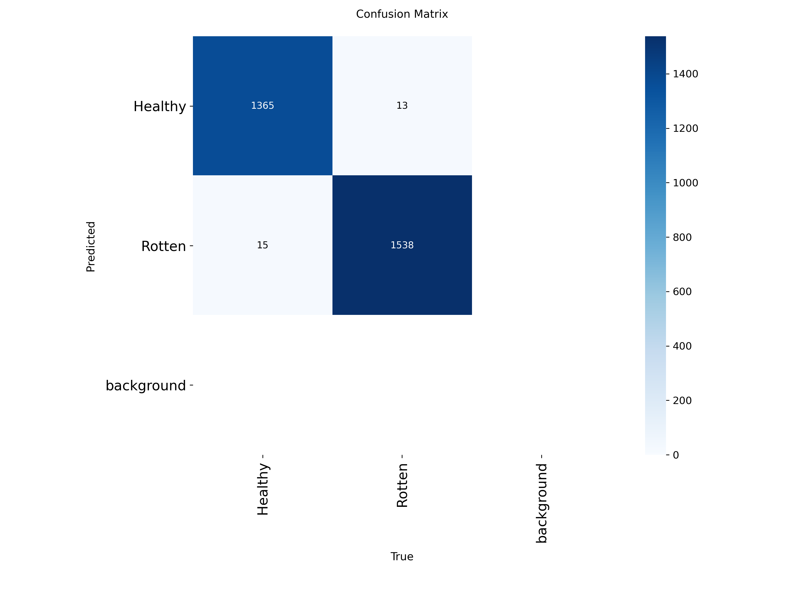

# Clasificación Automatizada de Calidad en Frutas con YOLOv11 y MLflow

> Sistema de visión artificial para clasificar frutas como **sanas** o **podridas** mediante *fine-tuning* de YOLOv11-cls, entrenado sobre un clúster HPC (Yuca) con almacenamiento Lustre y seguimiento de experimentos con MLflow.

**Autor:** Joel Alfonso Pérez Díaz
**Estado:** funcional · pesos finales (`best.pt`) generados · métricas registradas en MLflow

---

## 1. Problema y motivación

Las pérdidas post-cosecha por deterioro visual de frutas representan un porcentaje significativo del desperdicio alimentario global. La inspección manual es lenta, subjetiva y difícil de escalar en centros de distribución, supermercados y plantas empacadoras.

Este proyecto aborda el problema con un enfoque **ligero y portable** basado en YOLOv11-cls: un clasificador binario (*Healthy* / *Rotten*) que puede desplegarse tanto en workstations locales como en infraestructura HPC, con trazabilidad completa de experimentos vía MLflow.

**Caso de uso objetivo:** triaje automático de calidad en líneas de selección, control de calidad en bodega y apoyo a procesos de toma de decisión en venta mayorista.

---

## 2. Stack tecnológico

| Componente | Herramienta |
|---|---|
| Lenguaje | Python 3.9 / 3.10 |
| Framework de visión | [Ultralytics YOLOv11](https://docs.ultralytics.com) (`yolo11n-cls.pt`) |
| Deep learning backend | PyTorch 2.3 + ROCm 5.7 (clúster Yuca, AMD Instinct MI210) |
| Seguimiento de experimentos | MLflow (backend `file://` sobre Lustre) |
| Dataset | `kagglehub` → Kaggle (`muhammad0subhan/fruit-and-vegetable-disease-healthy-vs-rotten`) |
| Utilidades | `opencv-python`, `pandas`, `matplotlib`, `tqdm` |
| Infraestructura | Clúster HPC Yuca  / Linux |

---

## 3. Estructura del proyecto

```text
computerVision/
├── Frutas_yolo_det.ipynb          # Notebook maestro: prep, eval e inferencia
├── frutas_pipeline.py             # CLI equivalente para ejecución en clúster
├── fruit_binary_yolo_cls/         # Dataset binario generado (train/val/test)
│   ├── train/{Healthy,Rotten}/
│   ├── val/{Healthy,Rotten}/
│   └── test/{Healthy,Rotten}/
├── runs/                          # Artefactos de Ultralytics (checkpoints + plots)
│   └── classify/
│       └── fruit_hs_vs_rt_cls_simple_ft5/
│           └── weights/best.pt    # Pesos finales del clasificador
├── mlruns/                        # Backend local de MLflow (file-store)
├── yolo11n-cls.pt                 # Pesos base preentrenados
├── mejor_modelo_frutas_final.pt   # Copia respaldada del mejor modelo
└── README.md
```


---

## 4. Guía de uso rápida

### 4.1. Requisitos

```bash
python -m venv .venv
source .venv/bin/activate          # Linux / WSL
# .venv\Scripts\activate           # Windows PowerShell
pip install ultralytics mlflow opencv-python pandas matplotlib tqdm kagglehub
```

### 4.2. Cargar `best.pt` y hacer inferencia

```python
from pathlib import Path
from ultralytics import YOLO

# Ajusta la ruta según entorno (Windows local o Lustre)
PATH_BEST_WEIGHTS = Path("runs/classify/fruit_hs_vs_rt_cls_simple_ft5/weights/best.pt")
assert PATH_BEST_WEIGHTS.exists(), f"No existe: {PATH_BEST_WEIGHTS}"

model = YOLO(str(PATH_BEST_WEIGHTS))
result = model.predict("ruta/a/imagen.jpg", imgsz=640, verbose=False)[0]

pred = result.names[int(result.probs.top1)]
conf = float(result.probs.top1conf.item())
print(f"Predicción: {pred} ({conf:.2%})")
```

### 4.3. Evaluar sobre test + registrar en MLflow

El notebook `Frutas_yolo_det.ipynb` contiene un bloque modular de evaluación que:

1. Valida la existencia de `best.pt` y del dataset.
2. Ejecuta `model.val(split="test", plots=True)` y extrae Top-1, Top-5 y matriz de confusión.
3. Registra parámetros (`imgsz`, `batch`, `conf`, `iou`), métricas y artefactos (`.pt`, plots, CSV) en un *run* de MLflow.

Para visualizar los resultados:

```bash
mlflow ui --backend-store-uri ./mlruns --port 5000
```

### 4.4. Ejecución desde CLI

```bash
# Inferencia puntual
python frutas_pipeline.py --image sample.jpg --output-image salida.jpg

# Inferencia batch sobre una carpeta
python frutas_pipeline.py --input-dir inference_images --output-dir inference_outputs
```

---

## 5. Resultados

### 5.1. Métricas de clasificación

Evaluación sobre el split de test (2,931 imágenes):

| Métrica | Validación | Test |
|---|---|---|
| **Accuracy Top-1** | 0.9867 | **0.9904** |
| **Accuracy Top-5** | 1.0000 | 1.0000 |
| **Fitness** | 0.9933 | 0.9952 |

> Top-5 = 1.0 es esperado en un problema binario; Top-1 es la métrica de referencia.

### 5.2. Matriz de confusión

Las gráficas se generan automáticamente en `runs/classify/val*/confusion_matrix.png` y se registran como artefactos en MLflow:

```text
runs/classify/val2/
├── confusion_matrix.png
└── confusion_matrix_normalized.png
```


```markdown

```

### 5.3. Configuración del entrenamiento

| Hiperparámetro | Valor |
|---|---|
| Modelo base | `yolo11n-cls.pt` |
| Image size | 640 |
| Batch size | 32 |
| Épocas | 5 (con `freeze=10`) |
| Optimizador | por defecto (SGD, lr=0.01) |
| Device | AMD Instinct MI210 (ROCm) |
| Dataset | 23,432 train · 2,928 val · 2,931 test |

---

## 6. Roadmap

- [ ] Exportar modelo a ONNX / TensorRT para inferencia en edge.
- [ ] Ampliar a clasificación multi-especie (manzana, plátano, naranja, etc.) con `task=classify` multiclase.
- [ ] Integrar servicio REST con FastAPI para inferencia como microservicio.
- [ ] CI mínimo: `pytest` + `ruff` + validación de shape del `best.pt`.

---

## 7. Créditos

- **Autoría y desarrollo:** Joel Alfonso Pérez Díaz.
- **Modelo base:** [Ultralytics YOLOv11](https://github.com/ultralytics/ultralytics).
- **Dataset:** [Fruit and Vegetable Disease (Healthy vs Rotten)](https://www.kaggle.com/datasets/muhammad0subhan/fruit-and-vegetable-disease-healthy-vs-rotten) — Muhammad Subhan (Kaggle).
- **Infraestructura HPC:** Clúster Yuca (AMD Instinct MI210 + ROCm).

---

## 8 Licencia

Uso académico y demostrativo. Consulta la licencia original del dataset en Kaggle antes de un uso comercial. El código del pipeline es propiedad intelectual de Joel Alfonso Pérez Díaz; contacta al autor para licenciamiento.
